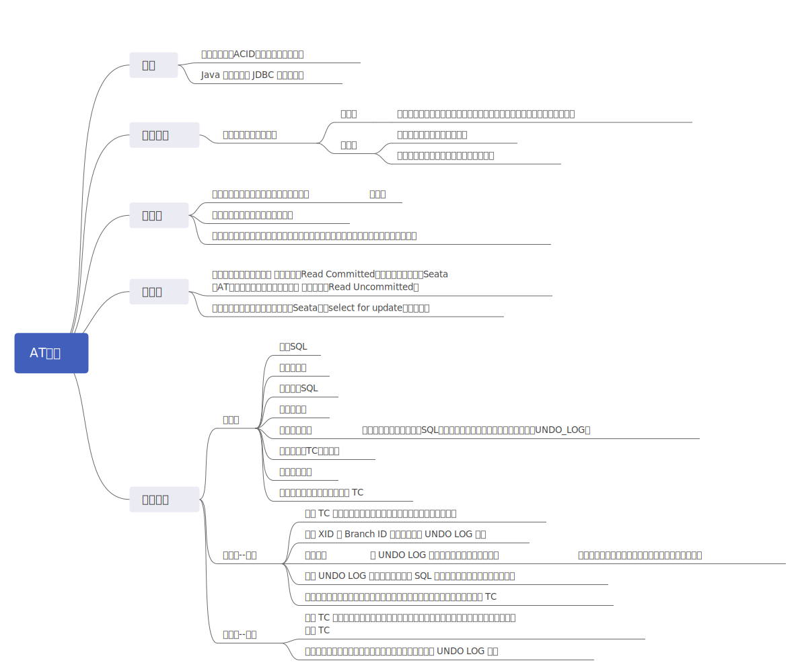
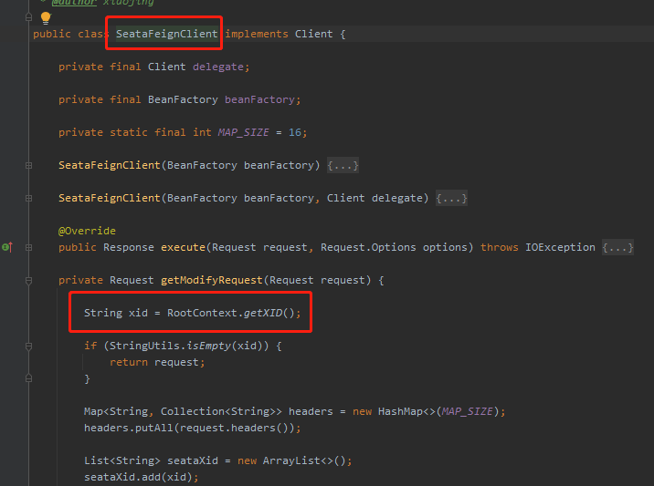

# hzero-seata-at-demo
## Seata 是什么

Seata 是一款开源的分布式事务解决方案，致力于提供高性能和简单易用的分布式事务服务。Seata 将为用户提供了 AT、TCC、SAGA 和 XA 事务模式，为用户打造一站式的分布式解决方案。

官网：http://seata.io/zh-cn/

## Seata 术语

- TC (Transaction Coordinator) - 事务协调者

  维护全局和分支事务的状态，驱动全局事务提交或回滚。（seata-server）

- TM (Transaction Manager) - 事务管理器

  定义全局事务的范围：开始全局事务、提交或回滚全局事务。（开启全局事务的服务）

- RM (Resource Manager) - 资源管理器

  管理分支事务处理的资源，与TC交谈以注册分支事务和报告分支事务的状态，并驱动分支事务提交或回滚。（分支事务的服务）

## Hzero 集成 seata

### seata 组件集成

框架组提供了 seata 开发组件（基于seata-rm增强），集成 hzero 只需要引入以下依赖即可

> hzero-parent 1.4 版本才引入了该组件，如果使用低版本 hzero 引入依赖时可以指定引入 hzero-starter-seata 的版本进行引入。当前组件最新版本为 1.4.0.RELEASE

```xml
<dependency>
    <groupId>org.hzero.starter</groupId>
    <artifactId>hzero-starter-seata</artifactId>
    <!-- hzero 1.4+ 无需特别指定版本 -->
    <version>${hzero.starter.veresion}</version>
</dependency>
```

### seata-server

`hzero-starter-seata` 组件需要搭配 `seata-server` 使用，而当前组件版本 `1.4.0.RELEASE`需使用1.1.0+的`seata-server`

这里可以选取 seata-server-1.4.0版本

seata-server下载地址: http://seata.io/zh-cn/blog/download.html

## AT 模式



[查看原图](./assets/img/seata/at-mode.svg)

### seata-server 配置

#### 目录结构

```lua
├── bin # 启动脚本
|  ├── seata-server.bat # windows 启动脚本
|  └── seata-server.sh # unix 启动脚本
├── conf # 配置文件
|  ├── file.conf # 配置文件
|  ├── file.conf.example # 配置文件示例
|  ├── logback.xml # logback 配置
|  ├── META-INF
|  ├── README-zh.md
|  ├── README.md
|  └── registry.conf # 注册中心配置
├── lib # 依赖包
└── LICENSE
```

#### 配置 eureka 注册中心

> seata-server 为了让用户快速体验，开箱即用，默认注册中心采用的是 file 模式，但在项目中我们用得比较多的便是 eureka 注册中心，而 seata-server 本身支持 eureka 注册中心，只需要修改一下配置文件 `registry.conf` 即可

```diff
@@ -1,6 +1,7 @@
 registry {
   # file 、nacos 、eureka、redis、zk、consul、etcd3、sofa
-  type = "file"
+  # 注册中心类型
+  type = "eureka"
   loadBalance = "RandomLoadBalance"
   loadBalanceVirtualNodes = 10

@@ -14,8 +15,10 @@ registry {
     password = ""
   }
   eureka {
-    serviceUrl = "http://localhost:8761/eureka"
-    application = "default"
+    # eureka 地址，逗号隔开
+    serviceUrl = "http://dev.hzero.org:8000/eureka"
+    # 注册到 eureka 显示名称，后续客户端配置需要与这个一致
+    application = "seata"
     weight = "1"
   }
   redis {
@@ -57,6 +60,7 @@ registry {

 config {
   # file、nacos 、apollo、zk、consul、etcd3
+  # 配置中心类型
   type = "file"

   nacos {
```

> 如果存在多个 eureka 注册中心，可以使用逗号隔开配置高可用

#### 配置存储模式

> seata-server 为了让用户快速体验，开箱即用，存储模式默认使用了 file 模式，而 file 模式无法支持高可用，因此我们修改为 redis 或者 db 模式，这里选择 redis 模式

```diff
@@ -1,7 +1,7 @@
 ## transaction log store, only used in seata-server
 store {
   ## store mode: file、db、redis
-  mode = "file"
+  mode = "redis"

   ## file store property
   file {
```


### 代码示例

> 源码地址：https://github.com/JodenHe/hzero-seata-demo/tree/main/seata-at

```lua
.
├── demo-account # 账户服务，用于扣减账户余额
├── demo-order # 订单服务，创建一个订单添加在order数据库，同时会扣减库存storage，扣减账户account
├── demo-storage # 库存服务，用户扣减库存
└── README.md
```

order 服务关键代码：

```java
@Override
@GlobalTransactional(name = "demo-create-order", rollbackFor = Exception.class) /* 此注解开启全局事务 */
public void create(Order order) {
    // 本地方法 创建订单
    order.setStatus(0);
    orderRepository.insertSelective(order);

    // 远程方法 扣减库存
    storageApi.decrease(order.getProductId(),order.getCount());

    // 远程方法 扣减账户余额
    accountApi.decrease(order.getUserId(),order.getMoney());
}
```

application.yml，每个微服务都需要进行配置 seata-client

```yaml
# seata
seata:
  enabled: true
  # 你的当前服务的application name
  application-id: ${spring.application.name}
  # 这里的名字与file.conf中vgroup_mapping.my_test_tx_group = "default"相同
  tx-service-group: my_test_tx_group
  enable-auto-data-source-proxy: true
  use-jdk-proxy: false
  client:
    rm:
      async-commit-buffer-limit: 1000
      report-retry-count: 5
      table-meta-check-enable: false
      report-success-enable: true
      lock:
        retry-interval: 10
        retry-times: 30
        retry-policy-branch-rollback-on-conflict: true
    tm:
      commit-retry-count: 5
      rollback-retry-count: 5
    undo:
      data-validation: true
      log-serialization: jackson
      log-table: undo_log
    log:
      exceptionRate: 100
  service:
    vgroup-mapping:
      # eureka 注册的seata-server 名称
      my_test_tx_group: seata
      # 这个参数集群环境不需要配置
      #grouplist:
      #default: 101.133.223.27:8080
    enable-degrade: false
    disable-global-transaction: false
  transport:
    shutdown:
      wait: 3
    thread-factory:
      boss-thread-prefix: NettyBoss
      worker-thread-prefix: NettyServerNIOWorker
      server-executor-thread-prefix: NettyServerBizHandler
      share-boss-worker: false
      client-selector-thread-prefix: NettyClientSelector
      client-selector-thread-size: 1
      client-worker-thread-prefix: NettyClientWorkerThread
    type: TCP
    server: NIO
    heartbeat: true
    serialization: seata
    compressor: none
    enable-client-batch-send-request: true
  config:
    type: file
    file:
      name: file.conf
  registry:
    type: eureka
    eureka:
      application: seata
      weight: 1
      service-url: ${eureka.client.serviceUrl.defaultZone}
```

#### 使用步骤

1. 拉取本demo代码 git clone xxxx;
2. [下载seata-server](https://github.com/seata/seata/releases);
3. 执行每个项目下的建表语句，resources/script/db下xx.sql文件；
4. 分别启动三个项目，swagger测试创建订单

#### 模拟异常情况

account 服务

```java
@Override
    public void decrease(Long userId, BigDecimal money) {
        log.info("------->扣减账户开始account中");
        // 模拟超时异常，全局事务回滚
        try {
            Thread.sleep(40*1000);
        } catch (InterruptedException e) {
            e.printStackTrace();
        }

        Account condition = new Account();
        condition.setUserId(userId);
        Account account = accountRepository.selectOne(condition);
        account.setUsed(account.getUsed().add(money));
        account.setResidue(account.getResidue().subtract(money));
        accountRepository.updateOptional(account, Account.FIELD_RESIDUE, Account.FIELD_USED);
        log.info("------->扣减账户结束account中");
    }
```

#### 调用成环

前面的调用链为order->storage->account; 这里测试的成环是指order->storage->account->order， 这里的account服务又会回头去修改order在前面添加的数据。 经过测试，是支持此种场景的。

```java
@Override
    public void decrease(Long userId, BigDecimal money) {
        log.info("------->扣减账户开始account中");
        // 模拟超时异常，全局事务回滚
        /*try {
            Thread.sleep(40*1000);
        } catch (InterruptedException e) {
            e.printStackTrace();
        }*/

        Account condition = new Account();
        condition.setUserId(userId);
        Account account = accountRepository.selectOne(condition);
        account.setUsed(account.getUsed().add(money));
        account.setResidue(account.getResidue().subtract(money));
        accountRepository.updateOptional(account, Account.FIELD_RESIDUE, Account.FIELD_USED);
        log.info("------->扣减账户结束account中");

        // 修改订单状态，此调用会导致调用成环
        log.info("修改订单状态开始");
        String mes = orderApi.update(userId, money.multiply(new BigDecimal("0.09")), 0);
        log.info("修改订单状态结束：{}",mes);
    }
```

在最初的order会创建一个订单，然后扣减库存，然后扣减账户，账户扣减完，会回头修改订单的金额和状态，这样调用就成环了。

### 问题

- 分支事务无法获取事务 xid

  在使用 feign 调用微服务时，通过线程上下文方式获取 xid 的，当设置了 hystrix 的隔离级别为 `THREAD` 便无法获取到线程上下文

  

  解决方法：

  - 禁用 hystrix

    ```yaml
    feign:
      hystrix:
        enabled: false
    ```

    

  - 将隔离级别改为信号量

    ```yaml
    hystrix:
      command:
        default:
          execution:
            isolation:
              semaphore:
    ```

    参照：https://www.cnblogs.com/duanxz/p/10949816.html

  - 自定义 hystrix 并发策略

    参照：https://blog.csdn.net/lptnyy/article/details/108552074

- seata-server 1.3.0 store mode是redis时**分支事务**提交获取不到全局锁

  order 服务修改订单状态报错日志

  ```text/plain
  2020-11-08 13:55:58.972 ERROR 4020 --- [  XNIO-3 task-7] o.h.core.exception.BaseExceptionHandler  : Could not commit JDBC transaction; nested exception is io.seata.rm.datasource.exec.LockConflictException: get global lock fail, xid:10.8.0.158:8091:68701624503754752, lockKeys:demo_order:15
  
  org.springframework.transaction.TransactionSystemException: Could not commit JDBC transaction; nested exception is io.seata.rm.datasource.exec.LockConflictException: get global lock fail, xid:10.8.0.158:8091:68701624503754752, lockKeys:demo_order:15
  	at org.springframework.jdbc.datasource.DataSourceTransactionManager.doCommit(DataSourceTransactionManager.java:332) ~[spring-jdbc-5.0.10.RELEASE.jar:5.0.10.RELEASE]
  	at org.springframework.transaction.support.AbstractPlatformTransactionManager.processCommit(AbstractPlatformTransactionManager.java:746) ~[spring-tx-5.0.10.RELEASE.jar:5.0.10.RELEASE]
  	at org.springframework.transaction.support.AbstractPlatformTransactionManager.commit(AbstractPlatformTransactionManager.java:714) ~[spring-tx-5.0.10.RELEASE.jar:5.0.10.RELEASE]
  	at org.springframework.transaction.interceptor.TransactionAspectSupport.commitTransactionAfterReturning(TransactionAspectSupport.java:532) ~[spring-tx-5.0.10.RELEASE.jar:5.0.10.RELEASE]
  	at org.springframework.transaction.interceptor.TransactionAspectSupport.invokeWithinTransaction(TransactionAspectSupport.java:304) ~[spring-tx-5.0.10.RELEASE.jar:5.0.10.RELEASE]
  	at org.springframework.transaction.interceptor.TransactionInterceptor.invoke(TransactionInterceptor.java:98) ~[spring-tx-5.0.10.RELEASE.jar:5.0.10.RELEASE]
  	at org.springframework.aop.framework.ReflectiveMethodInvocation.proceed(ReflectiveMethodInvocation.java:185) ~[spring-aop-5.0.10.RELEASE.jar:5.0.10.RELEASE]
  	at org.springframework.aop.framework.CglibAopProxy$DynamicAdvisedInterceptor.intercept(CglibAopProxy.java:688) ~[spring-aop-5.0.10.RELEASE.jar:5.0.10.RELEASE]
  	at com.hand.demo.infra.repository.impl.OrderRepositoryImpl$$EnhancerBySpringCGLIB$$1.updateOptional(<generated>) ~[classes/:na]
  	at com.hand.demo.app.service.impl.OrderServiceImpl.update(OrderServiceImpl.java:63) ~[classes/:na]
  	at com.hand.demo.app.service.impl.OrderServiceImpl$$FastClassBySpringCGLIB$$1.invoke(<generated>) ~[classes/:na]
  	at org.springframework.cglib.proxy.MethodProxy.invoke(MethodProxy.java:204) ~[spring-core-5.0.10.RELEASE.jar:5.0.10.RELEASE]
  	at org.springframework.aop.framework.CglibAopProxy$CglibMethodInvocation.invokeJoinpoint(CglibAopProxy.java:746) ~[spring-aop-5.0.10.RELEASE.jar:5.0.10.RELEASE]
  	at org.springframework.aop.framework.ReflectiveMethodInvocation.proceed(ReflectiveMethodInvocation.java:163) ~[spring-aop-5.0.10.RELEASE.jar:5.0.10.RELEASE]
  	at io.seata.spring.annotation.GlobalTransactionalInterceptor.invoke(GlobalTransactionalInterceptor.java:87) ~[seata-all-1.1.0.jar:1.1.0]
  	at org.springframework.aop.framework.ReflectiveMethodInvocation.proceed(ReflectiveMethodInvocation.java:185) ~[spring-aop-5.0.10.RELEASE.jar:5.0.10.RELEASE]
  	at org.springframework.aop.framework.CglibAopProxy$DynamicAdvisedInterceptor.intercept(CglibAopProxy.java:688) ~[spring-aop-5.0.10.RELEASE.jar:5.0.10.RELEASE]
  	at com.hand.demo.app.service.impl.OrderServiceImpl$$EnhancerBySpringCGLIB$$1.update(<generated>) ~[classes/:na]
  	at com.hand.demo.api.controller.v1.OrderController.update(OrderController.java:110) ~[classes/:na]
  	at sun.reflect.NativeMethodAccessorImpl.invoke0(Native Method) ~[na:1.8.0_144]
  	at sun.reflect.NativeMethodAccessorImpl.invoke(NativeMethodAccessorImpl.java:62) ~[na:1.8.0_144]
  	at sun.reflect.DelegatingMethodAccessorImpl.invoke(DelegatingMethodAccessorImpl.java:43) ~[na:1.8.0_144]
  	at java.lang.reflect.Method.invoke(Method.java:498) ~[na:1.8.0_144]
  	at org.springframework.web.method.support.InvocableHandlerMethod.doInvoke(InvocableHandlerMethod.java:209) ~[spring-web-5.0.10.RELEASE.jar:5.0.10.RELEASE]
  	at org.springframework.web.method.support.InvocableHandlerMethod.invokeForRequest(InvocableHandlerMethod.java:136) ~[spring-web-5.0.10.RELEASE.jar:5.0.10.RELEASE]
  	at org.springframework.web.servlet.mvc.method.annotation.ServletInvocableHandlerMethod.invokeAndHandle(ServletInvocableHandlerMethod.java:102) ~[spring-webmvc-5.0.10.RELEASE.jar:5.0.10.RELEASE]
  	at org.springframework.web.servlet.mvc.method.annotation.RequestMappingHandlerAdapter.invokeHandlerMethod(RequestMappingHandlerAdapter.java:891) ~[spring-webmvc-5.0.10.RELEASE.jar:5.0.10.RELEASE]
  	at org.springframework.web.servlet.mvc.method.annotation.RequestMappingHandlerAdapter.handleInternal(RequestMappingHandlerAdapter.java:797) ~[spring-webmvc-5.0.10.RELEASE.jar:5.0.10.RELEASE]
  	at org.springframework.web.servlet.mvc.method.AbstractHandlerMethodAdapter.handle(AbstractHandlerMethodAdapter.java:87) ~[spring-webmvc-5.0.10.RELEASE.jar:5.0.10.RELEASE]
  	at org.springframework.web.servlet.DispatcherServlet.doDispatch(DispatcherServlet.java:991) ~[spring-webmvc-5.0.10.RELEASE.jar:5.0.10.RELEASE]
  	at org.springframework.web.servlet.DispatcherServlet.doService(DispatcherServlet.java:925) ~[spring-webmvc-5.0.10.RELEASE.jar:5.0.10.RELEASE]
  	at org.springframework.web.servlet.FrameworkServlet.processRequest(FrameworkServlet.java:974) [spring-webmvc-5.0.10.RELEASE.jar:5.0.10.RELEASE]
  	at org.springframework.web.servlet.FrameworkServlet.doPut(FrameworkServlet.java:888) [spring-webmvc-5.0.10.RELEASE.jar:5.0.10.RELEASE]
  	at javax.servlet.http.HttpServlet.service(HttpServlet.java:710) [javax.servlet-api-3.1.0.jar:3.1.0]
  	at org.springframework.web.servlet.FrameworkServlet.service(FrameworkServlet.java:851) [spring-webmvc-5.0.10.RELEASE.jar:5.0.10.RELEASE]
  	at javax.servlet.http.HttpServlet.service(HttpServlet.java:790) [javax.servlet-api-3.1.0.jar:3.1.0]
  	at io.undertow.servlet.handlers.ServletHandler.handleRequest(ServletHandler.java:74) [undertow-servlet-1.4.26.Final.jar:1.4.26.Final]
  	at io.undertow.servlet.handlers.FilterHandler$FilterChainImpl.doFilter(FilterHandler.java:129) [undertow-servlet-1.4.26.Final.jar:1.4.26.Final]
  	at io.choerodon.resource.filter.JwtTokenFilter.doFilter(JwtTokenFilter.java:90) [hzero-starter-core-1.3.1.RELEASE.jar:1.3.1.RELEASE]
  	at io.undertow.servlet.core.ManagedFilter.doFilter(ManagedFilter.java:61) [undertow-servlet-1.4.26.Final.jar:1.4.26.Final]
  	at io.undertow.servlet.handlers.FilterHandler$FilterChainImpl.doFilter(FilterHandler.java:131) [undertow-servlet-1.4.26.Final.jar:1.4.26.Final]
  	at org.springframework.boot.actuate.web.trace.servlet.HttpTraceFilter.doFilterInternal(HttpTraceFilter.java:90) [spring-boot-actuator-2.0.6.RELEASE.jar:2.0.6.RELEASE]
  	at org.springframework.web.filter.OncePerRequestFilter.doFilter(OncePerRequestFilter.java:107) [spring-web-5.0.10.RELEASE.jar:5.0.10.RELEASE]
  	at io.undertow.servlet.core.ManagedFilter.doFilter(ManagedFilter.java:61) [undertow-servlet-1.4.26.Final.jar:1.4.26.Final]
  	at io.undertow.servlet.handlers.FilterHandler$FilterChainImpl.doFilter(FilterHandler.java:131) [undertow-servlet-1.4.26.Final.jar:1.4.26.Final]
  	at org.springframework.security.web.FilterChainProxy$VirtualFilterChain.doFilter(FilterChainProxy.java:320) [spring-security-web-5.0.9.RELEASE.jar:5.0.9.RELEASE]
  	at org.springframework.security.web.access.intercept.FilterSecurityInterceptor.invoke(FilterSecurityInterceptor.java:127) [spring-security-web-5.0.9.RELEASE.jar:5.0.9.RELEASE]
  	at org.springframework.security.web.access.intercept.FilterSecurityInterceptor.doFilter(FilterSecurityInterceptor.java:91) [spring-security-web-5.0.9.RELEASE.jar:5.0.9.RELEASE]
  	at org.springframework.security.web.FilterChainProxy$VirtualFilterChain.doFilter(FilterChainProxy.java:334) [spring-security-web-5.0.9.RELEASE.jar:5.0.9.RELEASE]
  	at org.springframework.security.web.access.ExceptionTranslationFilter.doFilter(ExceptionTranslationFilter.java:119) [spring-security-web-5.0.9.RELEASE.jar:5.0.9.RELEASE]
  	at org.springframework.security.web.FilterChainProxy$VirtualFilterChain.doFilter(FilterChainProxy.java:334) [spring-security-web-5.0.9.RELEASE.jar:5.0.9.RELEASE]
  	at org.springframework.security.web.session.SessionManagementFilter.doFilter(SessionManagementFilter.java:137) [spring-security-web-5.0.9.RELEASE.jar:5.0.9.RELEASE]
  	at org.springframework.security.web.FilterChainProxy$VirtualFilterChain.doFilter(FilterChainProxy.java:334) [spring-security-web-5.0.9.RELEASE.jar:5.0.9.RELEASE]
  	at org.springframework.security.web.authentication.AnonymousAuthenticationFilter.doFilter(AnonymousAuthenticationFilter.java:111) [spring-security-web-5.0.9.RELEASE.jar:5.0.9.RELEASE]
  	at org.springframework.security.web.FilterChainProxy$VirtualFilterChain.doFilter(FilterChainProxy.java:334) [spring-security-web-5.0.9.RELEASE.jar:5.0.9.RELEASE]
  	at org.springframework.security.web.servletapi.SecurityContextHolderAwareRequestFilter.doFilter(SecurityContextHolderAwareRequestFilter.java:170) [spring-security-web-5.0.9.RELEASE.jar:5.0.9.RELEASE]
  	at org.springframework.security.web.FilterChainProxy$VirtualFilterChain.doFilter(FilterChainProxy.java:334) [spring-security-web-5.0.9.RELEASE.jar:5.0.9.RELEASE]
  	at org.springframework.security.web.savedrequest.RequestCacheAwareFilter.doFilter(RequestCacheAwareFilter.java:63) [spring-security-web-5.0.9.RELEASE.jar:5.0.9.RELEASE]
  	at org.springframework.security.web.FilterChainProxy$VirtualFilterChain.doFilter(FilterChainProxy.java:334) [spring-security-web-5.0.9.RELEASE.jar:5.0.9.RELEASE]
  	at org.springframework.security.web.authentication.logout.LogoutFilter.doFilter(LogoutFilter.java:116) [spring-security-web-5.0.9.RELEASE.jar:5.0.9.RELEASE]
  	at org.springframework.security.web.FilterChainProxy$VirtualFilterChain.doFilter(FilterChainProxy.java:334) [spring-security-web-5.0.9.RELEASE.jar:5.0.9.RELEASE]
  	at org.springframework.security.web.header.HeaderWriterFilter.doFilterInternal(HeaderWriterFilter.java:66) [spring-security-web-5.0.9.RELEASE.jar:5.0.9.RELEASE]
  	at org.springframework.web.filter.OncePerRequestFilter.doFilter(OncePerRequestFilter.java:107) [spring-web-5.0.10.RELEASE.jar:5.0.10.RELEASE]
  	at org.springframework.security.web.FilterChainProxy$VirtualFilterChain.doFilter(FilterChainProxy.java:334) [spring-security-web-5.0.9.RELEASE.jar:5.0.9.RELEASE]
  	at org.springframework.security.web.context.SecurityContextPersistenceFilter.doFilter(SecurityContextPersistenceFilter.java:105) [spring-security-web-5.0.9.RELEASE.jar:5.0.9.RELEASE]
  	at org.springframework.security.web.FilterChainProxy$VirtualFilterChain.doFilter(FilterChainProxy.java:334) [spring-security-web-5.0.9.RELEASE.jar:5.0.9.RELEASE]
  	at org.springframework.security.web.context.request.async.WebAsyncManagerIntegrationFilter.doFilterInternal(WebAsyncManagerIntegrationFilter.java:56) [spring-security-web-5.0.9.RELEASE.jar:5.0.9.RELEASE]
  	at org.springframework.web.filter.OncePerRequestFilter.doFilter(OncePerRequestFilter.java:107) [spring-web-5.0.10.RELEASE.jar:5.0.10.RELEASE]
  	at org.springframework.security.web.FilterChainProxy$VirtualFilterChain.doFilter(FilterChainProxy.java:334) [spring-security-web-5.0.9.RELEASE.jar:5.0.9.RELEASE]
  	at org.springframework.security.web.FilterChainProxy.doFilterInternal(FilterChainProxy.java:215) [spring-security-web-5.0.9.RELEASE.jar:5.0.9.RELEASE]
  	at org.springframework.security.web.FilterChainProxy.doFilter(FilterChainProxy.java:178) [spring-security-web-5.0.9.RELEASE.jar:5.0.9.RELEASE]
  	at org.springframework.web.filter.DelegatingFilterProxy.invokeDelegate(DelegatingFilterProxy.java:357) [spring-web-5.0.10.RELEASE.jar:5.0.10.RELEASE]
  	at org.springframework.web.filter.DelegatingFilterProxy.doFilter(DelegatingFilterProxy.java:270) [spring-web-5.0.10.RELEASE.jar:5.0.10.RELEASE]
  	at io.undertow.servlet.core.ManagedFilter.doFilter(ManagedFilter.java:61) [undertow-servlet-1.4.26.Final.jar:1.4.26.Final]
  	at io.undertow.servlet.handlers.FilterHandler$FilterChainImpl.doFilter(FilterHandler.java:131) [undertow-servlet-1.4.26.Final.jar:1.4.26.Final]
  	at org.springframework.web.filter.RequestContextFilter.doFilterInternal(RequestContextFilter.java:99) [spring-web-5.0.10.RELEASE.jar:5.0.10.RELEASE]
  	at org.springframework.web.filter.OncePerRequestFilter.doFilter(OncePerRequestFilter.java:107) [spring-web-5.0.10.RELEASE.jar:5.0.10.RELEASE]
  	at io.undertow.servlet.core.ManagedFilter.doFilter(ManagedFilter.java:61) [undertow-servlet-1.4.26.Final.jar:1.4.26.Final]
  	at io.undertow.servlet.handlers.FilterHandler$FilterChainImpl.doFilter(FilterHandler.java:131) [undertow-servlet-1.4.26.Final.jar:1.4.26.Final]
  	at org.springframework.web.filter.HttpPutFormContentFilter.doFilterInternal(HttpPutFormContentFilter.java:109) [spring-web-5.0.10.RELEASE.jar:5.0.10.RELEASE]
  	at org.springframework.web.filter.OncePerRequestFilter.doFilter(OncePerRequestFilter.java:107) [spring-web-5.0.10.RELEASE.jar:5.0.10.RELEASE]
  	at io.undertow.servlet.core.ManagedFilter.doFilter(ManagedFilter.java:61) [undertow-servlet-1.4.26.Final.jar:1.4.26.Final]
  	at io.undertow.servlet.handlers.FilterHandler$FilterChainImpl.doFilter(FilterHandler.java:131) [undertow-servlet-1.4.26.Final.jar:1.4.26.Final]
  	at org.springframework.web.filter.HiddenHttpMethodFilter.doFilterInternal(HiddenHttpMethodFilter.java:93) [spring-web-5.0.10.RELEASE.jar:5.0.10.RELEASE]
  	at org.springframework.web.filter.OncePerRequestFilter.doFilter(OncePerRequestFilter.java:107) [spring-web-5.0.10.RELEASE.jar:5.0.10.RELEASE]
  	at io.undertow.servlet.core.ManagedFilter.doFilter(ManagedFilter.java:61) [undertow-servlet-1.4.26.Final.jar:1.4.26.Final]
  	at io.undertow.servlet.handlers.FilterHandler$FilterChainImpl.doFilter(FilterHandler.java:131) [undertow-servlet-1.4.26.Final.jar:1.4.26.Final]
  	at org.springframework.boot.actuate.metrics.web.servlet.WebMvcMetricsFilter.filterAndRecordMetrics(WebMvcMetricsFilter.java:155) [spring-boot-actuator-2.0.6.RELEASE.jar:2.0.6.RELEASE]
  	at org.springframework.boot.actuate.metrics.web.servlet.WebMvcMetricsFilter.filterAndRecordMetrics(WebMvcMetricsFilter.java:123) [spring-boot-actuator-2.0.6.RELEASE.jar:2.0.6.RELEASE]
  	at org.springframework.boot.actuate.metrics.web.servlet.WebMvcMetricsFilter.doFilterInternal(WebMvcMetricsFilter.java:108) [spring-boot-actuator-2.0.6.RELEASE.jar:2.0.6.RELEASE]
  	at org.springframework.web.filter.OncePerRequestFilter.doFilter(OncePerRequestFilter.java:107) [spring-web-5.0.10.RELEASE.jar:5.0.10.RELEASE]
  	at io.undertow.servlet.core.ManagedFilter.doFilter(ManagedFilter.java:61) [undertow-servlet-1.4.26.Final.jar:1.4.26.Final]
  	at io.undertow.servlet.handlers.FilterHandler$FilterChainImpl.doFilter(FilterHandler.java:131) [undertow-servlet-1.4.26.Final.jar:1.4.26.Final]
  	at org.springframework.web.filter.CharacterEncodingFilter.doFilterInternal(CharacterEncodingFilter.java:200) [spring-web-5.0.10.RELEASE.jar:5.0.10.RELEASE]
  	at org.springframework.web.filter.OncePerRequestFilter.doFilter(OncePerRequestFilter.java:107) [spring-web-5.0.10.RELEASE.jar:5.0.10.RELEASE]
  	at io.undertow.servlet.core.ManagedFilter.doFilter(ManagedFilter.java:61) [undertow-servlet-1.4.26.Final.jar:1.4.26.Final]
  	at io.undertow.servlet.handlers.FilterHandler$FilterChainImpl.doFilter(FilterHandler.java:131) [undertow-servlet-1.4.26.Final.jar:1.4.26.Final]
  	at io.undertow.servlet.handlers.FilterHandler.handleRequest(FilterHandler.java:84) [undertow-servlet-1.4.26.Final.jar:1.4.26.Final]
  	at io.undertow.servlet.handlers.security.ServletSecurityRoleHandler.handleRequest(ServletSecurityRoleHandler.java:62) [undertow-servlet-1.4.26.Final.jar:1.4.26.Final]
  	at io.undertow.servlet.handlers.ServletChain$1.handleRequest(ServletChain.java:65) [undertow-servlet-1.4.26.Final.jar:1.4.26.Final]
  	at io.undertow.servlet.handlers.ServletDispatchingHandler.handleRequest(ServletDispatchingHandler.java:36) [undertow-servlet-1.4.26.Final.jar:1.4.26.Final]
  	at io.undertow.servlet.handlers.security.SSLInformationAssociationHandler.handleRequest(SSLInformationAssociationHandler.java:132) [undertow-servlet-1.4.26.Final.jar:1.4.26.Final]
  	at io.undertow.servlet.handlers.security.ServletAuthenticationCallHandler.handleRequest(ServletAuthenticationCallHandler.java:57) [undertow-servlet-1.4.26.Final.jar:1.4.26.Final]
  	at io.undertow.server.handlers.PredicateHandler.handleRequest(PredicateHandler.java:43) [undertow-core-1.4.26.Final.jar:1.4.26.Final]
  	at io.undertow.security.handlers.AbstractConfidentialityHandler.handleRequest(AbstractConfidentialityHandler.java:46) [undertow-core-1.4.26.Final.jar:1.4.26.Final]
  	at io.undertow.servlet.handlers.security.ServletConfidentialityConstraintHandler.handleRequest(ServletConfidentialityConstraintHandler.java:64) [undertow-servlet-1.4.26.Final.jar:1.4.26.Final]
  	at io.undertow.security.handlers.AuthenticationMechanismsHandler.handleRequest(AuthenticationMechanismsHandler.java:60) [undertow-core-1.4.26.Final.jar:1.4.26.Final]
  	at io.undertow.servlet.handlers.security.CachedAuthenticatedSessionHandler.handleRequest(CachedAuthenticatedSessionHandler.java:77) [undertow-servlet-1.4.26.Final.jar:1.4.26.Final]
  	at io.undertow.security.handlers.AbstractSecurityContextAssociationHandler.handleRequest(AbstractSecurityContextAssociationHandler.java:43) [undertow-core-1.4.26.Final.jar:1.4.26.Final]
  	at io.undertow.server.handlers.PredicateHandler.handleRequest(PredicateHandler.java:43) [undertow-core-1.4.26.Final.jar:1.4.26.Final]
  	at io.undertow.server.handlers.PredicateHandler.handleRequest(PredicateHandler.java:43) [undertow-core-1.4.26.Final.jar:1.4.26.Final]
  	at io.undertow.servlet.handlers.ServletInitialHandler.jrHandle(ServletInitialHandler.java:40001) [undertow-servlet-1.4.26.Final.jar:1.4.26.Final]
  	at org.zeroturnaround.javarebel.integration.servlet.undertow.cbp.ServletInitialHandlerCBP.handleRequest(ServletInitialHandlerCBP.java:138) [ServletInitialHandlerCBP.class:na]
  	at io.undertow.servlet.handlers.ServletInitialHandler.handleFirstRequest(ServletInitialHandler.java:292) [undertow-servlet-1.4.26.Final.jar:1.4.26.Final]
  	at io.undertow.servlet.handlers.ServletInitialHandler.access$100(ServletInitialHandler.java:81) [undertow-servlet-1.4.26.Final.jar:1.4.26.Final]
  	at io.undertow.servlet.handlers.ServletInitialHandler$2.call(ServletInitialHandler.java:138) [undertow-servlet-1.4.26.Final.jar:1.4.26.Final]
  	at io.undertow.servlet.handlers.ServletInitialHandler$2.call(ServletInitialHandler.java:135) [undertow-servlet-1.4.26.Final.jar:1.4.26.Final]
  	at io.undertow.servlet.core.ServletRequestContextThreadSetupAction$1.call(ServletRequestContextThreadSetupAction.java:48) [undertow-servlet-1.4.26.Final.jar:1.4.26.Final]
  	at io.undertow.servlet.core.ContextClassLoaderSetupAction$1.call(ContextClassLoaderSetupAction.java:43) [undertow-servlet-1.4.26.Final.jar:1.4.26.Final]
  	at io.undertow.servlet.handlers.ServletInitialHandler.dispatchRequest(ServletInitialHandler.java:272) [undertow-servlet-1.4.26.Final.jar:1.4.26.Final]
  	at io.undertow.servlet.handlers.ServletInitialHandler.access$000(ServletInitialHandler.java:81) [undertow-servlet-1.4.26.Final.jar:1.4.26.Final]
  	at io.undertow.servlet.handlers.ServletInitialHandler$1.handleRequest(ServletInitialHandler.java:104) [undertow-servlet-1.4.26.Final.jar:1.4.26.Final]
  	at io.undertow.server.Connectors.executeRootHandler(Connectors.java:336) [undertow-core-1.4.26.Final.jar:1.4.26.Final]
  	at io.undertow.server.HttpServerExchange$1.run(HttpServerExchange.java:830) [undertow-core-1.4.26.Final.jar:1.4.26.Final]
  	at java.util.concurrent.ThreadPoolExecutor.runWorker(ThreadPoolExecutor.java:1149) [na:1.8.0_144]
  	at java.util.concurrent.ThreadPoolExecutor$Worker.run(ThreadPoolExecutor.java:624) [na:1.8.0_144]
  	at java.lang.Thread.run(Thread.java:748) [na:1.8.0_144]
  Caused by: io.seata.rm.datasource.exec.LockConflictException: get global lock fail, xid:10.8.0.158:8091:68701624503754752, lockKeys:demo_order:15
  	at io.seata.rm.datasource.ConnectionProxy.recognizeLockKeyConflictException(ConnectionProxy.java:151) ~[seata-all-1.1.0.jar:1.1.0]
  	at io.seata.rm.datasource.ConnectionProxy.processGlobalTransactionCommit(ConnectionProxy.java:215) ~[seata-all-1.1.0.jar:1.1.0]
  	at io.seata.rm.datasource.ConnectionProxy.doCommit(ConnectionProxy.java:192) ~[seata-all-1.1.0.jar:1.1.0]
  	at io.seata.rm.datasource.ConnectionProxy.lambda$commit$0(ConnectionProxy.java:180) ~[seata-all-1.1.0.jar:1.1.0]
  	at io.seata.rm.datasource.ConnectionProxy$LockRetryPolicy.execute(ConnectionProxy.java:283) ~[seata-all-1.1.0.jar:1.1.0]
  	at io.seata.rm.datasource.ConnectionProxy.commit(ConnectionProxy.java:179) ~[seata-all-1.1.0.jar:1.1.0]
  	at org.springframework.jdbc.datasource.DataSourceTransactionManager.doCommit(DataSourceTransactionManager.java:329) ~[spring-jdbc-5.0.10.RELEASE.jar:5.0.10.RELEASE]
  	... 126 common frames omitted
  ```

  详情见：https://github.com/seata/seata/issues/2938

  1.4.0 已修复，建议使用新版

- SQL Server 无法获取表名

  1.4.0.RELEASE 的 hzero-starter-seata 适配 sqlserver 存在问题，解决方法已提交 PR

  https://github.com/open-hand/hzero-starter-parent/pull/3